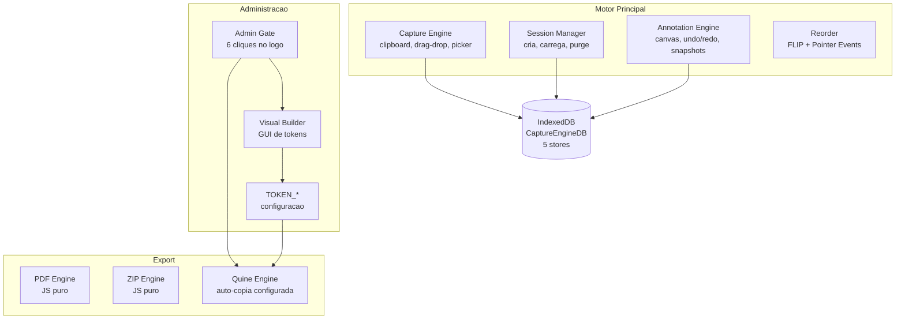
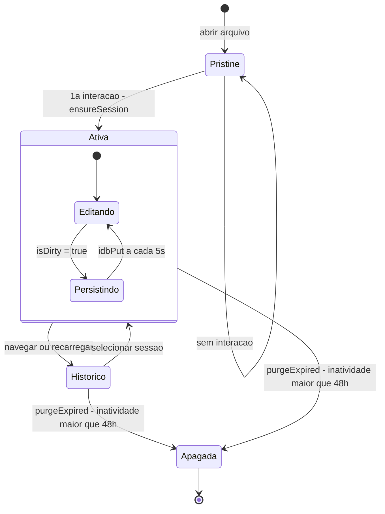
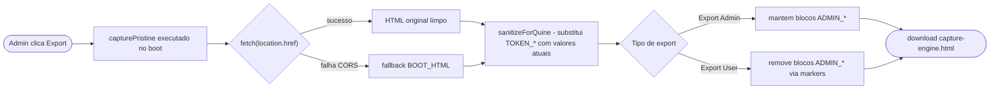

# Capture Engine · V25

> Uma ferramenta para capturar, organizar e exportar screenshots e documentos — funciona 100% offline, sem instalar nada, sem internet, sem servidores. Abre no browser como qualquer página web.

---

## Índice

1. [O que é o Capture Engine](#1-o-que-é-o-capture-engine)
2. [Para quem é](#2-para-quem-é)
3. [Conceitos fundamentais](#3-conceitos-fundamentais)
4. [Início rápido](#4-início-rápido)
5. [Funcionalidades em detalhe](#5-funcionalidades-em-detalhe)
6. [Modo Administrador](#6-modo-administrador)
7. [Segurança e privacidade](#7-segurança-e-privacidade)
8. [Limitações conhecidas](#8-limitações-conhecidas)
9. [Resolução de problemas](#9-resolução-de-problemas)
10. [Perguntas frequentes](#10-perguntas-frequentes)
11. [Requisitos](#11-requisitos)
12. [Estrutura de arquivos](#12-estrutura-de-arquivos)
13. [Arquitetura interna](#13-arquitetura-interna)

---

## 1. O que é o Capture Engine

O Capture Engine é **um único arquivo HTML** que funciona como uma aplicação completa de captura e exportação de evidências digitais. Não precisa de instalação, não requer internet, e não envia nenhum dado para servidores externos.

Tudo o que você captura (screenshots, documentos, textos) fica guardado localmente no browser do seu computador. Quando exporta, o PDF ou ZIP é gerado diretamente no browser, em memória, sem sair do seu dispositivo.

**Em termos simples:** funciona como uma pasta que vive dentro de um único arquivo. Você abre, cola ou arrasta arquivos, organiza, anota e exporta — tudo sem internet.

### Casos de uso

| Situação | Como o Capture Engine ajuda |
|---|---|
| Suporte técnico | Junta screenshots de erros, logs e configurações num único PDF para o ticket |
| Área jurídica | Reúne e exporta provas e documentos para processos ou audiências |
| Uso pessoal | Agrupa prints para submeter num portal, chamado ou formulário |
| Ambientes restritos (banco, governo, saúde) | Funciona sem internet, sem CDN, sem registro de dados externos |
| Auditoria e conformidade | Evidências documentadas e exportadas sem sair do dispositivo |

> **⚠️ Importante — os seus dados não ficam guardados para sempre (e isto é de propósito):** Por privacidade, o Capture Engine **apaga sozinho** qualquer sessão que fique mais de 48 horas sem ser usada, e **não guarda cópias de segurança automáticas**. Para conservar um trabalho, tem de o **exportar** (botão **PDF** ou **ZIP**) e guardar o arquivo você mesmo. Fechar o programa não basta; só o que exportar fica garantido.

---

## 2. Para quem é

O Capture Engine tem **três tipos de usuários** com responsabilidades diferentes:

### Usuário Final
Usa a ferramenta para capturar, organizar e exportar. Não precisa saber que existe um modo administrador. Recebe o arquivo `capture-engine.html` já configurado e pronto para uso.

**O que consegue fazer:** capturar imagens e documentos, anotar imagens, reordenar, exportar PDF ou ZIP.

**O que não consegue fazer:** alterar cores, títulos, ou configurações da ferramenta.

### Administrador
Configura a ferramenta para a sua organização — personaliza o nome, cores, campos e rodapé — e depois distribui a versão configurada aos usuários finais.

**O que consegue fazer:** tudo o que o usuário final consegue, mais acesso ao painel Visual Builder (via 6 cliques no logo).

**O que não consegue fazer:** alterar o código-fonte diretamente.

### Desenvolvedor / Agente IA
Edita o código-fonte do `capture-engine.html` para adicionar funcionalidades, corrigir bugs ou adaptar o motor a novos requisitos. **Leia o documento `agents.md` antes de qualquer modificação** — contém as regras absolutas, referência de funções, schema da base de dados, checklist de validação e protocolo de version bump.

---

## 3. Conceitos fundamentais

Esta seção explica os termos técnicos usados em toda a documentação. Se encontrar um termo desconhecido, procure aqui primeiro.

### Quine
Um **Quine** é um programa capaz de produzir uma cópia exata de si próprio como output. O Capture Engine usa este conceito: ao fazer Export, o arquivo lê o seu próprio código-fonte, aplica as configurações atuais, e gera um novo arquivo HTML idêntico — mas com os tokens personalizados. Isto permite ao administrador distribuir versões configuradas sem precisar de servidores ou ferramentas externas.

### IndexedDB
**IndexedDB** é uma base de dados embutida no browser, semelhante a um disco local dentro do browser. O Capture Engine a usa para guardar sessões, imagens e documentos automaticamente — sem servidor, sem arquivos externos. Os dados persistem enquanto o usuário não limpar os dados do browser.

**Importante:** Os dados do Capture Engine estão ligados ao browser e ao computador onde foram criados. Se limpar o histórico/cache do browser, os dados são apagados.

### Sessão
Uma **sessão** é um conjunto de trabalho — como um projeto ou pasta. Cada vez que abre o Capture Engine, começa uma sessão nova. Sessões anteriores ficam guardadas no histórico (ícone de relógio, lado direito).

### Token
Um **token** é uma variável de configuração do sistema. Por exemplo, `TOKEN_MAIN_COLOR` define a cor principal da interface. Os tokens são alterados pelo administrador no Visual Builder e ficam incorporados no arquivo HTML exportado.

### Visual Builder (VB)
O **Visual Builder** é o painel de configuração do administrador. É ativado com 6 cliques no logo no canto superior esquerdo. Permite alterar nome, cores, campos e rodapé da ferramenta sem editar código.

### Export Admin / Export User
Dois perfis de exportação do Quine Engine:
- **Export Admin** — gera uma cópia com todas as capacidades de administração. Outros admins podem reconfigurar e re-exportar.
- **Export User** — gera uma cópia limpa, sem painel de administração. Usuários finais recebem uma ferramenta focada apenas em capturar e exportar.

> **⚠️ AVISO CRÍTICO — Exportar não é fazer backup de dados:** O arquivo HTML gerado pelo Export contém **apenas a configuração** e o código da ferramenta. As imagens, documentos e histórico de sessões **não são exportados no HTML** — estes ficam permanentemente guardados no IndexedDB do browser.

### Diagnóstico de Export

Se suspeitar que as configurações não foram aplicadas no arquivo exportado, pode verificar manualmente:
1. Abra o arquivo HTML exportado num editor de texto simples (Notepad, TextEdit).
2. Procure por `const TOKEN_MAIN_COLOR`.
3. Verifique se o valor corresponde à cor que escolheu no Visual Builder. Se ainda mostrar o valor padrão, pode haver uma falha no formato interno do token ou os marcadores de proteção não estão íntegros.

### Funcionamento 100% Offline
Um sistema isolado (offline) é aquele sem acesso à internet — comum em bancos, hospitais e organismos governamentais. O Capture Engine foi desenhado especificamente para funcionar nestes ambientes: zero dependências externas.

### XSS (Cross-Site Scripting)
**XSS** é um tipo de ataque onde código malicioso é injetado numa página web. O Capture Engine sanitiza (limpa) todos os dados inseridos pelo usuário antes de apresentá-los, impedindo este tipo de ataque.

### IIFE (Immediately Invoked Function Expression)
Uma **IIFE** é um padrão JavaScript onde todo o código está encapsulado numa função que executa imediatamente. No Capture Engine, toda a lógica está dentro de uma IIFE — isto impede conflitos com outras variáveis ou scripts.

### FOUC (Flash of Unstyled Content)
**FOUC** é o flash momentâneo de conteúdo sem estilo que aparece antes de o JavaScript carregar (ex: fundo branco num usuário de dark mode). O Capture Engine tem proteção anti-FOUC: aplica o tema antes de qualquer pintura da tela.

### EMA (Exponential Moving Average)
**EMA** (média móvel exponencial) é um filtro de suavização usado no Desenho Livre: cada novo ponto do traço é misturado com o anterior por um fator α (α=0.35), reduzindo o tremor em tempo real sem atrasar perceptivelmente o traço. // calibrado empiricamente — não alterar sem validação manual

### Estado Pristine
O estado inicial e limpo da interface. Acontece quando abre a aplicação ou apaga a última sessão. Significa que a interface está vazia, campos limpos, e não há ainda nenhuma sessão ativa gravada na base de dados.

### initSessionSync
Função técnica chamada no arranque que atualiza visualmente a interface (botões, barra de estado) para refletir se a sessão atual já foi guardada (sincronizada) com o IndexedDB ou se ainda está num estado pendente/pristine.

---

## 4. Início rápido

### Abrir a aplicação

**Método simples (qualquer sistema operacional):**
1. Faça duplo clique em `capture-engine.html`
2. O arquivo abre no browser padrão

### Fluxo básico de trabalho

```
1. Abrir → Interface limpa, sem dados (estado inicial)
           ↓
2. Identificar (opcional) → Escrever nome do usuário e equipamento
           ↓
3. Capturar → Ctrl+V, arrastar arquivos, ou clicar "Adicionar Imagem"/"Adicionar Documento"
           ↓
4. Organizar → Arrastar itens para reordenar, clicar para ver ou anotar
           ↓
5. Exportar → PDF (imagens) ou ZIP (imagens + documentos)
```

### Dicas essenciais

- **Ctrl+V** cola qualquer coisa do clipboard: imagem, arquivo ou texto
- **Drag & Drop** funciona: arraste diretamente da Área de Trabalho ou do explorador de arquivos
- O histórico de sessões anteriores está no ícone de relógio (barra lateral direita)
- Itens removidos vão para a lixeira (barra inferior) — podem ser restaurados
- A aplicação guarda automaticamente a cada 5 segundos — mas só o que exportar (PDF/ZIP) fica garantido (fechar o browser dentro dessa janela pode perder as últimas alterações)

---

## 5. Funcionalidades em detalhe

### 5.1 Captura de conteúdo

O Capture Engine aceita conteúdo de três formas:

| Método | Como usar | O que captura |
|---|---|---|
| **Ctrl+V** | Pressione Ctrl+V com a app em foco | Imagem do clipboard, arquivo copiado, ou texto |
| **Drag & Drop** | Arraste o arquivo para a área de destino | Qualquer arquivo |
| **Picker** | Clique em "Adicionar Imagem" ou "Adicionar Documento" | Qualquer arquivo pelo seletor do sistema |

**Tipos de arquivo aceitos:**

| Categoria | Formatos |
|---|---|
| Imagens | PNG, JPEG, WEBP, GIF (capturadas como imagens) |
| Documentos de texto | TXT, CSV, XML, JSON, HTML, e outros formatos de texto simples (visualizáveis diretamente na app) |
| Documentos binários | PDF, DOCX, XLSX, e qualquer outro formato (guardados mas não visualizáveis inline — disponíveis para download) |

**Nomeação automática sem colisões:**
Ao colar a segunda imagem, a app não sobrescreve a primeira — atribui automaticamente `imagem-2`, `imagem-3`, etc. Renomeações manuais seguem a mesma lógica — nunca geram nomes duplicados.

**Comportamento do Ctrl+V por tipo de conteúdo:**
1. Se o clipboard contiver uma **imagem** → captura como imagem
2. Se o clipboard contiver um **arquivo não-imagem** → captura como documento
3. Se o clipboard contiver **texto** → captura como arquivo `.txt`

---

### 5.2 Visualizador de imagens (Zoom & Pan)

Ao clicar numa imagem, abre um modal com visualizador completo.

| Ação | Como fazer |
|---|---|
| **Abrir** | Clicar no thumbnail da imagem |
| **Zoom in/out** | Roda do mouse (scroll), centrado na posição do cursor |
| **Pan (mover)** | Clicar e arrastar quando a imagem está ampliada |
| **Zoom com botões** | Botões +/−/Reset na barra flutuante (aparece quando zoom > 100%) |
| **Navegar ← →** | Botões de seta flutuantes nas laterais (visíveis quando há ≥2 imagens na sessão), ou teclas ArrowLeft / ArrowRight |
| **Fechar** | Botão × ou clicar fora da imagem (apenas quando zoom = 100%) |

**Limites de zoom:** 20% (mínimo) a 1000% (máximo).

**Nota:** Quando a imagem está ampliada (zoom > 100%), clicar fora do modal não fecha a janela — isto evita fechamentos acidentais durante o panning.

---

### 5.3 Anotação de imagens

Motor de anotação (V24→V25):
- 8 ferramentas: traço livre, retângulo, círculo, seta, texto (negrito B / itálico I), selecionar, Rotação 90°, Crop
- Selecionar: clique para selecionar qualquer anotação, caixa de seleção visível, apagar com Delete ou botão ✕
- Mover: arrastar qualquer anotação para reposicionar; botão direito = agarrar e mover em qualquer ferramenta
- Redimensionar: alças nos 4 cantos de qualquer anotação; texto por escala contínua
- Editar: alterar cor, espessura e tamanho de anotações já inseridas sem recriar
- Desfazer/Refazer: até 50 passos, histórico preservado ao navegar entre imagens da sessão

Mobile (V25):
- Desenho por toque funciona (Pointer Events nativos)
- Scroll de fundo bloqueado quando qualquer modal está aberto
- Botões de apagar e restaurar sempre visíveis em dispositivos touch
- Toolbar em 3 linhas: ferramentas / cores+espessura / ações

---

### 5.4 Reordenação

Todos os itens (imagens e documentos) podem ser reordenados por **drag & drop**:
- Em imagens: arraste o thumbnail para a posição desejada na grade
- Em documentos: arraste o card para cima ou para baixo na lista

A nova ordem é guardada automaticamente.

---

### 5.5 Lixeira

Itens removidos não são apagados imediatamente — vão para a **Trash Bar** (barra inferior).

| Ação | Como fazer |
|---|---|
| **Ver itens removidos** | Clicar na barra "Removidos" na parte inferior |
| **Restaurar item** | Abrir o item na lixeira → botão "Restaurar" |
| **Apagar definitivamente** | Dentro do modal do item → botão de apagar permanente |

A lixeira persiste entre sessões — os itens removidos ficam até serem apagados definitivamente ou até a sessão expirar.

---

### 5.6 Export PDF

Gera um PDF com uma imagem por página.

**Modos de página disponíveis:**

| Modo | Comportamento |
|---|---|
| **Auto** | Detecta orientação de cada imagem individualmente (retrato ou paisagem) |
| **A4 Vertical** | Força todas as páginas em formato retrato |
| **A4 Horizontal** | Força todas as páginas em formato paisagem |

**Processo de geração:**
1. As imagens PNG originais são convertidas para JPEG em memória (qualidade configurável, padrão 92%)
2. O PDF é construído com uma imagem por página, escalada para preencher o máximo da página A4 mantendo a proporção, centrada
3. O arquivo é transferido automaticamente

**Quando o botão PDF fica desativado:** Quando há documentos (não-imagens) na sessão. O motor PDF processa apenas imagens. Para sessões mistas, use o ZIP.

**Os arquivos originais não são alterados.** A conversão JPEG acontece apenas na memória, durante a geração do PDF. Os originais permanecem em PNG na sessão.

**GIF animados no PDF:** apenas o primeiro quadro é incluído — a animação se perde. Para preservar a animação, use o export ZIP.

---

### 5.7 Export ZIP

Empacota todos os itens da sessão (imagens e documentos) num único arquivo ZIP.

**O que é incluído:**
- Imagens em PNG (no formato original, sem recompressão)
- GIF animados no formato original, com animação intacta
- Documentos em todos os formatos
- Nomes de arquivo limpos baseados nas legendas/nomes definidos (ex: `imagem-1.png`, `relatorio.pdf`)

**Opções de ZIP (quando há imagens na sessão):**
- **Imagens em PDF** — inclui as imagens como PDF + documentos separados
- **Imagens Separadas** — inclui tudo como arquivos individuais

---

### 5.8 Sessões e histórico

**Comportamento ao abrir:**
Cada abertura do Capture Engine começa com uma sessão nova em branco. A interface abre limpa — sem dados de sessões anteriores. Sessões anteriores ficam guardadas no histórico.

**Quando a sessão aparece no histórico:**
A sessão nova só aparece no histórico após a primeira interação real (colar uma imagem, escrever o nome do usuário, arrastar um documento). Sessões sem interação não são guardadas.

**Identificação de sessão:**
- **Nome da sessão** — campo de texto livre no topo da sidebar esquerda
- **Campo User** — nome do usuário que está a trabalhar (configurável)
- **Campo Equipamento** — nome do computador ou equipamento (configurável)
- Se não for preenchido nenhum nome, a sessão recebe um identificador automático (`#0001`, `#0002`, etc.)

**Purge automático:**
Sessões sem atividade há mais de 48 horas (configurável) são apagadas automaticamente ao abrir a aplicação. O critério é a data de **última atividade**, não a data de criação.

**Navegar entre sessões:**
1. Clicar no ícone de relógio (barra lateral direita)
2. Selecionar a sessão desejada na lista
3. A sessão atual é guardada antes de navegar

---

## 6. Modo Administrador

### 6.1 Ativar o modo administrador

O painel de administração não é visível por padrão. Para ativá-lo:

1. **Clicar 6 vezes seguidas no logo** (canto superior esquerdo)
2. Dois botões aparecem na barra de topo: Visual Builder (ícone engrenagem) e Export (ícone disquete)

O modo administrador não persiste entre aberturas — tem de ser ativado de novo cada vez que abre a aplicação.

6 cliques no logo dentro de 3 segundos (janela deslizante — cliques com mais de 3 s são descartados). Enquanto o modo admin está ativo, 3 cliques rápidos em menos de 1 segundo desativam-no.

### 6.2 O Visual Builder

O Visual Builder é o painel de configuração. Está dividido em três abas:

**Aba Interface:**
- Nome da ferramenta (texto inicial + texto em destaque)
- Cor principal (color picker)
- Cor do texto sobre a cor principal (auto-detecção se vazio)
- Texto do rodapé (`{YEAR}` é substituído pelo ano atual)

**Aba Histórico (Campos de Sessão):**
- Ativar/desativar Campo 1 (por padrão: "User")
- Ativar/desativar Campo 2 (por padrão: "Equipamento")
- Rótulo personalizado do Campo 1
- Rótulo personalizado do Campo 2

**Aba Captura:**
- Qualidade do PDF (0.70 a 0.95 — afeta apenas a geração de PDF, não os originais)
- Dimensão máxima de redimensionamento de imagens (0 = sem limite)
- Horas até purge automático de sessões

**Nota importante:** As alterações feitas no Visual Builder são **temporárias** até ser feito um Export. Ao fechar e reabrir o arquivo, as configurações voltam ao padrão guardado no arquivo.

### 6.3 Guardar configurações (Export)

O botão Export abre o painel de exportação com duas opções:

**Export Admin:**
- Gera uma cópia do arquivo com as configurações atuais
- Mantém o painel de administração e a capacidade de re-exportar
- Use para distribuir a outros administradores ou como backup da configuração

**Export User:**
- Gera uma cópia limpa do arquivo com as configurações atuais
- Remove o painel de administração, o Visual Builder e a capacidade de re-exportar
- Ativa automaticamente o modo de produção (logs desativados)
- Use para distribuir aos usuários finais

**Fluxo de distribuição típico:**
```
Admin configura → Export Admin (backup) → Export User → distribui aos usuários
```

> **ℹ️ Atualizações e continuidade dos dados:** Pode distribuir uma nova versão da ferramenta (novo arquivo) sem receio de o usuário perder o histórico: em Windows com Edge/Chrome, **o nome e a pasta do arquivo não afetam o acesso aos dados** — todas as cópias abertas no mesmo perfil de browser compartilham a mesma base `CaptureEngineDB` (testado em Edge 148 / Chrome 148). O acesso depende do **perfil de browser**, não do caminho. As exceções (que NÃO veem os dados) são: janela anônima, outro perfil, outro browser, e abrir de dentro de um ZIP sem extrair. Ver a seção de recuperação para o detalhe completo.

### 6.4 Tokens de configuração

Os tokens são as variáveis internas que controlam o comportamento da ferramenta. O Visual Builder edita estes tokens graficamente.

| Token | Valor padrão | O que controla |
|---|---|---|
| `TOKEN_TITLE_START` | `'Capture '` | Primeira parte do nome no topo (cor normal, negrito). O espaço final é intencional. |
| `TOKEN_TITLE_ACCENT` | `'Engine'` | Segunda parte (na cor de destaque, mais transparente) |
| `TOKEN_TITLE_END` | `''` | Terceira parte do nome (cor normal, negrito). Espaços manuais. Campo "Texto Final" no VB. Exemplo de white-label: 'Capture Engine Pro' — onde 'Pro' ocuparia o terceiro span com cor de destaque independente |
| `TOKEN_TITLE_START_COLOR` | `''` | Cor da 1.ª parte do título (vazio = usa a cor normal do texto) |
| `TOKEN_TITLE_ACCENT_COLOR` | `''` | Cor da 2.ª parte do título (vazio = usa a cor de destaque) |
| `TOKEN_TITLE_END_COLOR` | `''` | Cor da 3.ª parte do título (vazio = usa a cor normal do texto) |
| `TOKEN_MAIN_COLOR` | `'#e86b2e'` | Cor principal da interface |
| `TOKEN_ACCENT_FG_OVERRIDE` | `''` | Cor do texto sobre a cor principal (vazio = automático) |
| `TOKEN_FOOTER_TEXT` | `'© {YEAR} • CAPTURE ENGINE • DIOGO CARVALHO'` | Texto do rodapé |
| `TOKEN_SHOW_SESSION_USER` | `true` | Mostra/oculta o Campo 1 (User) |
| `TOKEN_SHOW_SESSION_PC` | `true` | Mostra/oculta o Campo 2 (Equipamento) |
| `TOKEN_USER_LABEL` | `''` | Rótulo do Campo 1 (vazio = usa "User") |
| `TOKEN_EQUIP_LABEL` | `''` | Rótulo do Campo 2 (vazio = usa "Equipamento") |
| `TOKEN_JPEG_QUALITY` | `0.92` | Qualidade de compressão JPEG no export PDF |
| `TOKEN_MAX_IMG_DIMENSION` | `0` | Dimensão máxima de imagens (0 = sem limite) |
| `TOKEN_AUTO_PURGE_HOURS` | `48` | Horas de inatividade até purge automático. **Atenção ao redistribuir:** se reduzir este valor numa nova versão, sessões que antes sobreviveriam serão purgadas na próxima abertura — `purgeExpired()` usa sempre o valor atual do token. **ℹ️ Valor 0 desativa o purge completamente:** o código tem o guard `if (!TOKEN_AUTO_PURGE_HOURS) return` — com valor `0` o purge não executa e nenhuma sessão é apagada. Para purge infrequente mas não desabilitado, use um valor alto como `8760` (1 ano). |
| `TOKEN_DEBUG_MODE` | `true` | Logs na consola do browser (desativado em Export User) |

### 6.5 Distribuir uma atualização (nova versão)

Quando existe uma nova versão do `capture-engine.html` e há usuários com sessões ativas:

**Os dados das sessões não estão no arquivo HTML** — estão no IndexedDB do browser. Substituir o arquivo não apaga nem migra dados. O fluxo correto é:

```
1. Antes de atualizar — fazer Export Admin da versão atual
   (preserva as configurações personalizadas — cores, nome, campos, rodapé)
         ↓
2. Abrir o novo capture-engine.html num editor de texto
   Aplicar manualmente as configurações guardadas (ou re-configurar no Visual Builder)
         ↓
3. Fazer Export User → distribuir o novo arquivo aos usuários
         ↓
4. Os usuários abrem o novo arquivo — as sessões anteriores aparecem automaticamente
   (o IndexedDB é compartilhado por perfil de browser, não pelo arquivo)
```

**O que é seguro:**
- Substituir o arquivo em qualquer pasta ou com qualquer nome — os dados continuam acessíveis
- Uma versão mais nova vê as sessões criadas numa versão mais antiga (todos usam `CaptureEngineDB`)

**O que requer atenção:**
- Configurações personalizadas (cores, nome, tokens) **não viajam** com os dados — são parte do arquivo HTML e têm de ser reaplicadas manualmente ou via Export Admin
- Se a nova versão incrementar a versão do schema IndexedDB (atualmente `2`), consultar `agents.md` §6 sobre migração de schema antes de distribuir

**Aviso sobre `TOKEN_AUTO_PURGE_HOURS`:** se a nova versão tiver um valor de purge menor do que o anterior, sessões que ainda estariam vivas são purgadas na primeira abertura. Ver §6.4.

---

## 7. Segurança e privacidade

| Característica | Detalhe |
|---|---|
| **Zero dependências externas** | Sem CDNs, sem bibliotecas remotas, sem Google Fonts — nada carregado da internet |
| **Isolado / Offline** | Funciona 100% offline; nenhum dado sai do dispositivo |
| **Sanitização de inputs** | Todo o texto inserido pelo usuário é sanitizado antes de ser apresentado (proteção XSS) |
| **Content Security Policy** | Metatag CSP no cabeçalho HTML restringe scripts e recursos que podem ser carregados. Diretivas ativas: `default-src 'self' blob: data:; script-src 'unsafe-inline' (necessário: todo CSS e JS está inline por contrato de arquivo único; o Quine gera novos arquivos e invalidaria nonces a cada export); style-src 'unsafe-inline'; img-src blob: data:; connect-src 'self';` |
| **Admin Gate oculto** | O painel de admin requer 6 cliques no logo — invisível e inatingível acidentalmente |
| **Sem registro** | Nenhum dado de utilização, telemetria ou analytics |
| **Sem cookies** | Usa IndexedDB e localStorage do browser (sem cookies de sessão) |

### Content Security Policy — nota sobre `unsafe-inline`

A CSP ativa inclui `script-src 'unsafe-inline'` e `style-src 'unsafe-inline'`. Isto é uma **consequência estrutural da arquitetura single-file**, não uma escolha de comodidade:

- Toda a lógica JavaScript está inline no único arquivo HTML — sem `unsafe-inline`, o browser bloquearia o próprio script da aplicação.
- Nonces e hashes são incompatíveis com o Quine Engine: o conteúdo do arquivo muda a cada Export, invalidando qualquer hash calculado no build.
- A CSP ainda protege contra **scripts externos** (`default-src 'self'`), **recursos de rede** (`connect-src 'self'`) e **imagens externas** (`img-src blob: data:`).

> Em scanners de segurança automáticos (OWASP ZAP, Lighthouse), `unsafe-inline` será marcado como aviso. O contexto acima explica por que é intencional neste modelo.

### Aviso sobre limpeza do browser

Os dados do Capture Engine estão guardados no IndexedDB do browser. **Se limpar os dados de navegação, cache, ou histórico do browser, os dados do Capture Engine são apagados permanentemente.** Exporte sempre os dados importantes antes de limpar o browser.

### Comportamento com múltiplas abas

O Capture Engine pode ser aberto em várias abas do mesmo browser — todas compartilham a mesma base de dados local. **Atenção:** como todas as abas gravam na mesma base, editar a mesma sessão em duas abas ao mesmo tempo pode fazer com que uma sobreponha as alterações da outra (a última gravação prevalece). Para evitar confusão, trabalhe numa sessão de cada vez. Em versões anteriores, abrir uma segunda aba mostrava uma tela de erro a bloquear o uso; esse bloqueio foi removido.

---

## Integridade e limites para uso probatório

O Capture Engine é adequado para **recolha organizada e documentação** de evidências digitais, mas não constitui por si só uma cadeia de custódia forense verificável.

**O que a ferramenta garante:**
- Timestamp de criação e última atividade registado por sessão (gerado pelo browser do dispositivo)
- Armazenamento local isolado — os dados não saem do dispositivo sem ação explícita do utilizador
- Exportação ZIP com os ficheiros originais sem reprocessamento adicional

**O que a ferramenta não garante:**
- Integridade criptográfica — não há hash, assinatura digital nem timestamping independente
- Imutabilidade — os dados no IndexedDB são editáveis pelo utilizador e pelo próprio browser
- Rastreabilidade de cadeia de custódia — não há registo de acessos ou modificações
- **Exportação PDF:** as imagens são recomprimidas como JPEG em memória (processo com perda) — não adequado como prova primária de imagem em contexto forense onde a integridade pixel-a-pixel seja exigida; usar exportação ZIP para preservar os ficheiros originais

Para uso em processos judiciais ou auditorias reguladas, complementar com procedimentos de custódia externos (hash independente dos ficheiros exportados, registo de acesso, etc.).

---

## Acessibilidade

**Estado atual (V25):**
- Navegação por teclado: parcialmente suportada nos controlos principais
- Rácios de contraste WCAG: verificados para a cor de destaque principal (ver `design-tokens.md §1`)
- Leitores de ecrã: não testados formalmente
- ARIA e ordem de foco: não auditados

**Conformidade declarada:** nenhuma conformidade formal com WCAG 2.1 ou EN 301 549 foi auditada nesta versão.

Para implementações em setor público, bancário ou saúde onde a acessibilidade seja requisito regulatório, recomenda-se avaliação independente antes da adoção.

---

## 8. Limitações conhecidas

| Limitação | Detalhe |
|---|---|
| **Sem sincronização** | Os dados só existem no browser do computador onde foram criados. Não há sincronização entre dispositivos. |
| **Dependente do browser** | Limpar dados do browser apaga todos os dados. |
| **Múltiplas abas compartilham a base** | Pode abrir em várias abas, mas todas usam a mesma base de dados local. Editar a mesma sessão em duas abas ao mesmo tempo pode fazer uma sobrepor a outra (prevalece a última gravação). |
| **PDF sem documentos** | O export PDF processa apenas imagens. Documentos (PDF, DOCX, etc.) requerem export ZIP. |
| **Sem preview de binários** | Documentos binários (PDF, DOCX, XLSX) não têm pré-visualização inline — apenas download. |
| **Quota do browser (atenção)** | O IndexedDB tem um limite de espaço definido pelo browser. Se esse espaço esgotar, a aplicação deixa de conseguir gravar novas capturas. **Importante:** de momento isto acontece sem aviso visível na tela — o erro só fica registrado no console técnico (F12). O que já estava guardado não se corrompe, mas uma captura nova feita com o espaço esgotado pode não chegar a ser gravada. Em sessões grandes, exporte com frequência. **Referência prática:** cada imagem PNG usa tipicamente 100 KB a 2 MB. Sessões com 100–150 imagens de alta resolução podem acumular 200–500 MB — a partir desse volume exporte regularmente. Use o script de diagnóstico no `agents.md §14` para verificar o uso real. |
| **Sem limite fixo de itens** | A ferramenta não impõe um número máximo de imagens ou documentos; o limite prático é o espaço de armazenamento do browser (ver linha acima). Em sessões muito grandes, o export de PDF/ZIP fica mais lento, porque tudo é processado na memória do browser. |
| **GIF animados — comportamento por export** | O export **ZIP** inclui o arquivo GIF original com a animação intacta. O export **PDF** converte cada frame para JPEG e renderiza apenas a primeira frame — a animação perde-se. Se precisar preservar a animação, use sempre o export ZIP. |

---

## 9. Resolução de problemas

### A aplicação não abre ou mostra página em branco
- Verifique se está a usar Chrome 90+, Edge 90+, ou Firefox 151.0.4 testado
- Experimente abrir diretamente com duplo clique no `capture-engine.html`
- Em alguns sistemas, arquivos HTML locais precisam de permissão — verifique as configurações de segurança do browser

### Os dados desapareceram
- Os dados do Capture Engine ficam no IndexedDB do browser. Se limpou os dados do browser (histórico, cache, dados de sites), os dados foram apagados.
- Os dados só existem no computador e browser onde foram criados.
- Certifique-se de exportar os dados importantes antes de limpar o browser.

### O Ctrl+V não cola nada
- Clique primeiro dentro da área da aplicação (fora de qualquer campo de texto) para garantir que a app tem foco
- Em mobile, use o botão flutuante de colar FAB (Floating Action Button) no canto inferior direito
- Verifique se o browser tem permissão para acessar o clipboard (aparece uma notificação)
- Ctrl+V suporta múltiplos ficheiros copiados do Explorer em simultâneo (Ctrl+C nos ficheiros → Ctrl+V na aplicação).

### O botão PDF está desativado
- O export PDF só funciona com imagens. Se há documentos (PDF, DOCX, etc.) na sessão, o botão desativa automaticamente.
- Use o export ZIP para sessões com imagens e documentos juntos.

### O modal de anotação não fecha com Escape
- Se uma ferramenta de anotação estiver ativa, Escape cancela a ferramenta — não fecha o modal. Pressione Escape novamente para fechar.

### Sessões com mais de 48 horas desapareceram
- O purge automático apaga sessões sem atividade há mais de 48 horas (configurável). Este comportamento é intencional e pode ser ajustado pelo administrador via `TOKEN_AUTO_PURGE_HOURS`.

### As minhas capturas desapareceram depois de fechar o browser
- O mais provável é esgotamento silencioso da quota de armazenamento do browser. Quando o IndexedDB fica sem espaço, a gravação falha silenciosamente — o item aparece na grade durante a sessão (via Object URL em memória) mas não chega a ser persistido. Ao fechar o browser, a memória é liberada e o item desaparece.
- **Como confirmar:** abra as DevTools (F12) → separador Console → procure erros com a palavra `quota` ou `storage`.
- **Como prevenir:** em sessões grandes, exporte com frequência (PDF ou ZIP). O administrador pode configurar `TOKEN_MAX_IMG_DIMENSION` para reduzir o tamanho de cada imagem antes de ser gravada — consultar o Visual Builder → aba Captura.

### Perdi o arquivo HTML. Perdi os dados? (Disaster Recovery)
- **Provavelmente não.** Os dados não estão dentro do arquivo HTML — ficam guardados no IndexedDB do browser, numa base partilhada por **perfil de browser** (comportamento confirmado por testes em Windows 11 com Edge 148 e Chrome 148; ✅ Verificado — IndexedDB persiste mesmo após remoção do arquivo HTML no Firefox; no Safari este detalhe não foi testado formalmente e pode variar). Se apagou o `capture-engine.html`, basta abrir **qualquer** cópia da ferramenta no **mesmo perfil do mesmo browser** e as sessões reaparecem.
- **O que NÃO afeta o acesso aos dados** (confirmado por teste): o **nome** do arquivo, a **pasta**, o **disco/pen**, a **versão** (uma versão antiga vê as sessões da nova — todas usam a mesma base `CaptureEngineDB`) e até caminhos com espaços ou caracteres especiais. Tudo isto continua a encontrar os dados, desde que seja o mesmo perfil.
- **O que NÃO encontra os dados** (origem/perfil diferente): **janela anônima/privada**, **outro perfil** do browser, **outro browser** (Edge vs Chrome têm bases separadas), e abrir **de dentro de um ZIP** sem extrair.
- **Os dados são locais a cada máquina e NÃO viajam com a conta.** Mesmo com a sincronização do Chrome ligada, abrir a mesma conta/perfil **em outro computador não traz as sessões** (testado: aparece vazio). O Chrome sincroniza favoritos, senhas, etc., mas não o IndexedDB.
- **Implicação para ambientes isolados (ex.: VDI (Virtual Desktop Infrastructure)):** como os dados vivem no perfil local daquela máquina/ambiente, sessões criadas dentro da VDI de um cliente ficam **isoladas** nessa VDI; sessões criadas no perfil local pessoal ficam todas juntas nesse perfil. *(Nota: ambientes com "roaming de perfil" gerenciados pela TI poderiam fazer os dados seguir o usuário entre máquinas — confirmar com a equipe de TI se for o caso.)*
- Recuperação técnica de último recurso (requer conhecimentos): separador *Application > IndexedDB* das DevTools (F12), base `CaptureEngineDB`.

> **A forma confiável de não perder nada é exportar (PDF ou ZIP) o que for importante.** Não há backup automático — é uma decisão de design (privacidade).

---

## 10. Perguntas frequentes

**O meu arquivo HTML tem ≈ 345 KB. É normal?**
Sim. O Capture Engine é uma aplicação completa encapsulada num único arquivo — inclui todo o CSS, toda a lógica JavaScript, e todos os ícones SVG inline. A versão de administrador (com o Visual Builder) ronda os ≈ 345 KB; a versão exportada para usuário final (Export User), sem o painel de admin, fica menor. Ambos os tamanhos são esperados para uma aplicação deste tipo.

**Os meus dados ficam guardados para sempre?**
Não. Sessões inativas há mais de 48 horas (por padrão) são apagadas automaticamente. Além disso, limpar os dados do browser apaga tudo. Exporte os dados importantes.

**Posso usar o Capture Engine em Mac ou Linux?**
Sim — abra diretamente o `capture-engine.html` no browser.

**Posso usar em Firefox?**
Sim. Firefox 151.0.4 — suporte completo, testado manualmente; versão mínima abaixo de 151.0.4 não verificada.

**Posso ter múltiplas versões do Capture Engine abertas ao mesmo tempo?**
Sim. Pode abrir várias abas no mesmo browser (todas compartilham a mesma base de dados local) ou versões diferentes em browsers diferentes (ex: uma no Edge e outra no Firefox, cada uma com a sua própria base). A única ressalva é não editar a mesma sessão em duas abas ao mesmo tempo, para uma não sobrepor a outra.

**O que acontece se colocar o token `EXPORT MODAL` no rodapé?**
Nada — a versão V15+ protege automaticamente os marcadores internos com um caractere invisível (zero-width space), impedindo que valores de tokens interfiram com o Quine Engine.

**Posso usar o Capture Engine como aplicação web (num servidor)?**
É tecnicamente possível, mas não é o caso de uso pretendido. A ferramenta foi desenhada para uso local (protocolo `file://`). Em servidores, podem surgir restrições de CORS no Quine Engine (fetch do próprio arquivo).

**Posso personalizar a ferramenta sem saber programar?**
Sim — o Visual Builder (6 cliques no logo) permite personalizar cores, nome, campos e rodapé sem tocar no código.

**Posso usar o Capture Engine em Edge e Chrome ao mesmo tempo com o mesmo histórico?**
Não. Edge e Chrome têm bases IndexedDB separadas — cada browser mantém o seu próprio histórico, mesmo sendo a mesma conta ou perfil. Para ver as mesmas sessões, use sempre o mesmo browser. O mesmo se aplica ao Firefox: dados criados no Chrome não aparecem no Firefox e vice-versa. Ver §11 para a matriz completa de compatibilidade.

---

## 11. Requisitos

### Requisitos mínimos
- **Chrome 90+ / Edge 90+** — suporte completo, testado em Chrome 148 / Edge 148; compatibilidade com versões abaixo de 148 estimada mas não verificada
- **Firefox 151.0.4** — suporte completo, testado manualmente; versão mínima abaixo de 151.0.4 não verificada
  - ⚠️ IndexedDB no Firefox persiste no perfil do browser — dados criados no Firefox não são visíveis no Chrome e vice-versa (origens distintas)
- **Safari** — suporte parcial; não testado formalmente. Pode apresentar falhas de CORS ao abrir arquivos locais `file://`, mitigadas pelo fallback `BOOT_HTML` do Quine; outros comportamentos não verificados
- Sem internet, sem servidor, sem instalação
- Qualquer sistema operacional com browser moderno

> Para uso em produção com requisitos de recuperação de dados, recomenda-se Chrome ou Edge (Chromium) ou Firefox 151.0.4 testado.

### Matriz de compatibilidade

| Browser | Versão testada | Captura e Export | IndexedDB `file://` | Quine (fetch) | Disaster Recovery |
|---|---|---|---|---|---|
| **Chrome** | 148, Windows 11 | ✅ Verificado | ✅ Verificado | ✅ Verificado | ✅ Verificado |
| **Edge** | 148, Windows 11 | ✅ Verificado | ✅ Verificado | ✅ Verificado | ✅ Verificado |
| **Firefox** | 151.0.4 testado | ✅ Verificado | ✅ Verificado | ✅ Verificado | ✅ Verificado — IndexedDB persiste mesmo após remoção do arquivo HTML |
| **Safari** | — | ⚠️ Parcial | ⚠️ Não testado | ⚠️ Pode falhar (CORS) | ⚠️ Não testado |

**Legenda:** ✅ verificado por teste manual · ⚠️ declarado ou com ressalvas

---

## 12. Estrutura de arquivos

```
capture-engine/              ← raiz do repositório
├── capture-engine.html      ← A aplicação completa — este é o arquivo que distribui
├── index.html               ← Redirect para GitHub Pages (abre capture-engine.html)
├── LICENSE                  ← Licença MIT (Diogo Carvalho)
├── README.md                ← Este guia (início aqui)
├── changelog.md             ← Histórico de versões desde a V7 (base da arquitetura atual; V1–V6 anteriores à arquitetura Quine)
├── agents.md                ← Guia operacional para desenvolvedores e agentes IA
├── design-tokens.md         ← Especificação completa do design system
└── validate.sh              ← Script de validação estática manual — executar antes de cada commit (não há hook git configurado no repositório)
```

**Qual arquivo distribuir aos usuários?**
- Para uso básico: apenas `capture-engine.html`
- Os outros arquivos (`.md`) são documentação interna — não precisam de ser distribuídos

---

## 13. Arquitetura interna

Esta seção é para quem precisa de entender como o sistema funciona internamente. Usuários finais podem ignorar.

### O arquivo único

```
capture-engine.html
│
├── <head>
│   └── Content Security Policy (metatag)
│
├── <style>
│   ├── Design tokens (variáveis CSS)
│   ├── Light mode (:root)
│   ├── Dark mode (body.dark)
│   ├── Layout principal
│   ├── Componentes (botões, modais, sidebar, cards)
│   ├── Responsividade (900px, 480px)
│   └── Animações
│
├── <body>
│   ├── Script anti-FOUC (aplica dark mode antes de pintar — logo após <body>)
│   ├── Barra de topo (logo, nome, botões de ação)
│   ├── Layout principal
│   │   ├── Sidebar esquerda (campos de sessão, controles de export)
│   │   ├── Painel de imagens (zona de drop + grade de thumbnails)
│   │   └── Painel de documentos (zona de drop + lista)
│   ├── Sidebar direita (histórico de sessões)
│   ├── Trash Bar (lixeira)
│   ├── Rodapé
│   └── Modais (imagem, documento, anotação, Visual Builder, export)
│
└── <script> — IIFE com 'use strict'
    │
    ├── SysLogger         → Logs na consola (respeitam TOKEN_DEBUG_MODE)
    ├── TOKENS            → Variáveis de configuração (TOKEN_*)
    ├── escapeHTML()      → Sanitização XSS de todos os inputs
    ├── IndexedDB         → Funções de acesso à base de dados local (idbGet, idbPut, idbDel, idbAll, idbIdx)
    ├── Session Manager   → Criar, carregar, apagar e navegar entre sessões
    ├── Capture Engine    → Receber imagens e documentos (clipboard, drag-drop, picker)
    ├── Reorder           → Drag-and-drop para reordenar itens
    ├── Annotation        → Canvas transparente para anotação sobre imagens
    ├── Text Viewer       → Visualizador de documentos de texto inline
    ├── PDF Engine        → Geração de PDFs em JavaScript puro (sem bibliotecas)
    ├── ZIP Engine        → Geração de ZIPs em JavaScript puro (sem bibliotecas)
    ├── Visual Builder    → Painel de configuração do administrador
    ├── Quine Engine      → Auto-exportação do arquivo com configurações
    ├── Admin Gate        → Ativa o modo admin (6 cliques no logo)
    └── boot()            → Chamada por init() após openDB() e purgeExpired(). Inicializa todos os subsistemas da interface.
```

### Como os componentes se ligam

```
init()
  ├── openDB()
  ├── purgeExpired()
  └── boot()
        ├── initClipboard()
        ├── initDragDrop()
        ├── initReorder()
        ├── initSidebar()
        ├── initPickers()
        ├── initTheme()
        ├── initTrashBar()
        ├── initPdfModal()
        ├── initVbSync()
        ├── initAdminGate()
        ├── initSessionSync()
        ├── initAnnotation()
        ├── applyTokens()
        ├── updateCounters()
        ├── updateBtns()
        ├── updateBtnTitles()
        ├── updateStatusBar()
        └── [ADMIN_JS] capturePristine()
```

### Base de dados local (IndexedDB)

**Nome da base de dados:** `CaptureEngineDB` (versão 2)

| Tabela | Chave primária | Campos principais | Índices |
|---|---|---|---|
| `sessions` | `id` | `name`, `user`, `pc`, `createdAt`, `updatedAt`, `exported` | `createdAt` |
| `images` | `id` | `sessionId`, `blob`, `label`, `order`, `addedAt` (+ `origBlob`, `annHistory` em imagens anotadas) | `sessionId`, `order` |
| `documents` | `id` | `sessionId`, `blob`, `name`, `type`, `size`, `order`, `addedAt` | `sessionId`, `order` |
| `removed_images` | `id` | `sessionId`, `blob`, `label`, `removedAt` | `sessionId` |
| `removed_documents` | `id` | `sessionId`, `blob`, `name`, `type`, `size`, `removedAt` | `sessionId` |

**Campos adicionais em imagens com edição ativa:**
- `rotation`: tipo número, graus de rotação acumulada, padrão `0`
- `cropBox`: objeto `{x, y, w, h}` em pixels relativos, ou `null` quando sem crop ativo

**Auto-save:** A cada 5 segundos, se `isDirty === true`. Digitação nos campos User/Equipamento/Nome guarda imediatamente.

### Diagrama de componentes



### Ciclo de vida da sessao



### Fluxo do Quine Engine



---

*Capture Engine V25 · Single-file · zero dependências · 100% offline*

---

## Licença

Capture Engine — Copyright (c) 2026 **Diogo Carvalho** (@diogocarvalhoinfo). Distribuído sob a **Licença MIT** (ver arquivo `LICENSE`).

Autoria e contato:
- Site: https://diogocarvalhoinfo.com
- GitHub: https://github.com/diogocarvalhoinfo

Em linguagem simples: qualquer pessoa pode usar, copiar, alterar e distribuir a ferramenta, de graça, inclusive em contexto profissional ou comercial. A única condição é **manter o aviso de copyright** ("Diogo Carvalho") junto das cópias. O software é fornecido "como está", sem garantias. O texto do rodapé da aplicação pode ser personalizado pelo administrador (white-label) — isso é branding e não substitui nem remove o aviso de copyright no código e no arquivo `LICENSE`.
